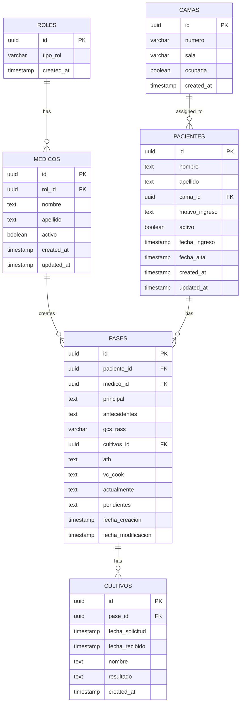

```mermaid
erDiagram
    ROLES ||--o{ MEDICOS : "has"
    CAMAS ||--o{ PACIENTES : "assigned_to"
    MEDICOS ||--o{ PASES : "creates"
    PACIENTES ||--o{ PASES : "has"
    PASES ||--o{ CULTIVOS : "has"

    ROLES {
        uuid id PK
        varchar tipo_rol
        timestamp created_at
    }

    MEDICOS {
        uuid id PK
        uuid rol_id FK
        text nombre
        text apellido
        boolean activo
        timestamp created_at
        timestamp updated_at
    }

    CAMAS {
        uuid id PK
        varchar numero
        varchar sala
        boolean ocupada
        timestamp created_at
    }

    PACIENTES {
        uuid id PK
        text nombre
        text apellido
        uuid cama_id FK
        text motivo_ingreso
        boolean activo
        timestamp fecha_ingreso
        timestamp fecha_alta
        timestamp created_at
        timestamp updated_at
    }

    PASES {
        uuid id PK
        uuid paciente_id FK
        uuid medico_id FK
        text principal
        text antecedentes
        varchar gcs_rass
        uuid cultivos_id FK
        text atb
        text vc_cook
        text actualmente
        text pendientes
        timestamp fecha_creacion
        timestamp fecha_modificacion
    }

    CULTIVOS {
        uuid id PK
        uuid pase_id FK
        timestamp fecha_solicitud
        timestamp fecha_recibido
        text nombre
        text resultado
        timestamp created_at
    }
```